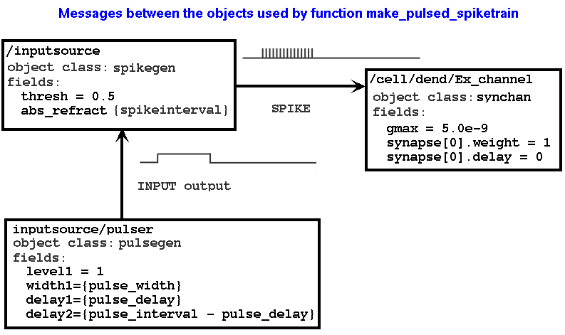

Notes on input models for G3
============================

The preliminary version of Tutorial 3 "How to convert your GENESIS 2
simulations to GENESIS 3"
(http://genesis-sim.org/userdocs/tutorial3/tutorial3.html) (better:
`tutorial3 <../tutorial3/tutorial3.html>`_) used the script
simplecell-g3.g as an example.  The input to the simple
two-compartment cell consists of a steady current injection to the
soma.  This was implemented in GENESIS 2 and under ns-sli
compatibility mode with the function make_input, which sets the
/cell/soma inject field to the current injection value.  After
converting the cell model to NDF format and loading it into the
G-shell, the injection can be provided with the command::

    genesis > runtime_parameter_add /cell/soma INJECT 0.5e-9

The next section of the tutorial will describe ways to provide other types
of input to stimulate the cell.  I'll extend simplecell-g3.g to make the
scripts simplecell-inputs-gr.g (with G2 graphics for a simple control
panel and graph of /cell/soma Vm) and simplecell-inputs.g (no graphics).

I have already modified graphics.g from the original simplecell version by
modifying function set_inject and moving it to the main script,
simplecell-inputs-gr.g.  Now, I'll strip graphics.g down to the minimum
needed for the plot and the injection current, without using xtools.g.  To
prevent confusion, I'll call it graphics1.g.

The string variable input_model will determine the type of input, with the options:

"inject"
    continous current injection to /cell/soma

"spiketrain"
    continous spike train to /cell/dend/Ex_channel

"pulsed_inject"
    pulsed current injection to /cell/soma

"pulsed_spiketrain"
    pulsed spike train to /cell/dend/Ex_channel

"randomspike"
    continous Poisson-distributed random spikes to /cell/dend/Ex_channel

The new function make_input invokes appropriate functions or commands to
provide the specified input::

    function make_input
        if (input_model == "inject")
	    set_inject {injcurrent}
        elif (input_model == "pulsed_inject")
	    make_pulsed_inject
        elif (input_model == "spiketrain")
	    make_spiketrain
        elif (input_model == "pulsed_spiketrain")
             make_pulsed_spiketrain
        elif (input_model == "randomspike")
             make_randomspike
        end
    end

Purpose of these examples
-------------------------

All of these function examples could (and probably should) be implemented
as standard input modes for ssp, gshell, and gtube.  However, there will
often be a need for more complex forms of stimulus input that will depend
on the biological model being studied.  This will be particularly true with
network models.  I would like to understand how these G2 functions for
"input models" can be converted to a G3 representation, without necessarily
implementing them as ssp or gshell options.  This will allow "user_defined"
to be an option to specify any reasonable combination of neural or device
objects as the source of input to the model system being studied.  As an
example,  the G2 scripts for the auditory cortex simulation use a model
for thalamic inputs that use a simple cell model coupled to two spikegen, two
randomspike, one pulsegen, and one diffamp objects.

A future tutorial on implementing "runtime analysis models" in G3, or
converting them from G2 SLI scripts will use combinations of table and
device objects to generate data that will be output to files during
the sumulation run.

Other implementation details
----------------------------

In function make_spiketrain, the spikegen (/spikesource/spiker) receives an
INPUT message from /spikesource specifying if it is ON or OFF.  The spike
rate (frequency) is 1.0/spikeinterval.  It is set by setting the spikegen
(/spikesource/spiker) abs_refract field to spikeinterval.

function make_randomspike is similar to make_spiketrain, but
/spikesource/spiker is a randomspike object that receives a RATE message
from spiker.  For consistency with with make_spiketrain, it will be set
to 1.0/spikeinterval to give the same average rate as the continous spike
train input.

Mon Aug  9 16:38:38 MDT 2010
~~~~~~~~~~~~~~~~~~~~~~~~~~~~

At this point, simplecell-inputs-gr.g works properly under G2 with all five
input model options.  Before I wrap it up and make the version with
"graphics = 0", I should do some cleanup and reorganization.

I need to summarize the ways to set parameters (e.g. pulse delay, width and
interval, injection magnitude, or spike frequency) for the various
input modes.  At this point, there isn't much consistency in the names
of the elements and their fields that need to be set.   I'll change
the input functions to use this organization:

/inputsource - The "input source" is the element that delivers the message
to the cell.  e.g., a pulsegen delivering a "INJECT output" to /cell/soma,
or a spikegen or randomspike delivering a "SPIKE" message to
/cell/dend/Ex_channel.  It will sometimes have child elements that gate or
otherwise control the input source.   For example /inputsource/pulse is
a pulsegen.

This will take a lot of renaming of elements, so I'll back up
simplecell-inputs-gr.g as simplecell-inputs0-gr.g in case I want to come to
the original version.

function make_spiketrain begins with::

    create spikegen /inputsource // generates spikes with interval abs_refract
    create neutral /inputsource/spiketoggle // turns inputsource ON/OFF

Setting /inputsource/spiketoggle x to 0 or 1 turns it ON/OFF.
Setting /inputsource abs_refract to the global variable spikeinterval
sets the spike interval.

function make_randomspike has::

    create randomspike /inputsource // Poissson-distributed spikes
    create neutral /inputsource/rate // x field sets the average rate

Setting /inputsource/rate x sets the average rate (frequency) of the
spikes.   function make_randomspike sets this to 1.0/spikeinterval.

function make_pulsed_spiketrain has::

    create spikegen /inputsource // generates spikes with interval abs_refract
    create pulsegen /inputsource/pulser // controls inputsource with pulses

Setting /inputsource abs_refract to the global variable spikeinterval
sets the spike interval.  The function set_pulse_timing is used to set
the gating pulse paramters to the global variables pulse_delay,
pulse_width, and pulse_interval.

function make_pulsed_inject is a problem, because here /inputsource would
be the pulsegen, rather than /inputsource/pulse.  I would like to use the
same function set_pulse_timing(delay, width, interval) to set these
parameters for all pulsegens.  Currently, I have::

    setfield /inputpulse level1 1.0 width1 {width} delay1 {delay}	 \
	baselevel 0.0 trig_mode 0 delay2 {interval - delay} width2 0

In G2, I can use a wildcard path::

    setfield /##[ISA=pulsegen] level1 1.0 width1 {width} delay1 \
        {delay} baselevel 0.0 trig_mode 0 delay2 {interval - delay} width2 0

If G3 complains about the wildcard paths (as it did with the original
rallpack3/axon.g), I can make explicit tests with::
 
    if ({exists {/inputsource/pulse}})

Using the wildcard path in set_pulse_timing, function make_pulsed_inject
sets the pulse parameters with set_pulse_timing, and the injection level
is set with::

    setfield /inputsource level1 {injcurrent} 

Note that the naming used here does not allow more than one of these input
models to be used at the same time.

Yet TODO Mon Aug  9 18:22:12 MDT 2010
~~~~~~~~~~~~~~~~~~~~~~~~~~~~~~~~~~~~~

* test it with the new organization

* make a function remove_input that simply does a delete of /inputsource.
  As it deletes the entire tree, the naming used here makes it easy.

* Add some more to graphics1.g, but still keeping xtools.g out of it.  I can 
  set pulse params, injection, and spike freq  - look at simplecell2.g

* Write some notes on advantages of randomspike over setting synchan
  frequency field.  Show how to set the synapse weight and delay.

* I wonder if G3 synchan could be enhanced to have a freq_weight field
  without a performance hit.

* Try conversion of input_model.notes to LaTeX with RST tools - make notes

* Use this as a test for entering into the documentation system.

Fri Aug 13 16:46:41 MDT 2010
~~~~~~~~~~~~~~~~~~~~~~~~~~~~

*rst2latex* and *rst2html* work well, although I may have to set some
*docutils.conf* options to get the same formatting used in userdocs.
I'll explore this when I try to enter this into the documentation system.

Instead of making a ``function remove_input``, I started ``function
make_input`` with::

    // First, remove any injection or other input
    setfield {injectpath} inject 0.0
    if ({exists /inputsource})
   	delete /inputsource
    end

The explicit setting of the soma inject field to zero was needed to
remove any effect of a previous use of set_inject.

Now, I can do a new run with different input by using, for example::

    reset
    input_model = "pulsed_spiketrain" 
    make_input
    reset
    step_tmax

This seems to work for all the input models.  I won't make any improvements
on graphics1.g for now, although it would be useful to be able to set
the pulse delay, width, and interval.

Use of of randomspike vs. setting synchan frequency field
---------------------------------------------------------

1. Run it with default input_model = "inject"

2. type ``set_inject 0.0``, or use the GUI to set injection to 0.

3. Enter the following commands::

        setfield /cell/dend/Ex_channel gmax 5e-9
        setfield /cell/dend/Ex_channel frequency 100
        reset
        step_tmax

   Observe the plot with either G2 graphics or G3PLot.

4. Then do
        reset
        input_model = "randomspike"
        make_input
        setfield /cell/dend/Ex_channel frequency 0 
        reset
        step_tmax

   The results were similar.  Of course, each run generates a different
   set of random numbers.

5.  Now do::

        showfield /cell/dend/Ex_channel synapse[0].weight synapse[0].delay

    which returned::

        [ /cell/dend/Ex_channel ]
        synapse[0].weight    = 1
        synapse[0].delay     = 0

    Then do::

        setfield /cell/dend/Ex_channel synapse[0].weight 0.2
        reset
        step_tmax

    This gives a lower spiking rate.

The point of this exercise is that there are two ways to produce a
Poissson-distributed random spike train with a given average frequency.
Simply setting the synchan frequency field to a non-zero value can produce
the same effect as delivering spikes from a randomspike object.
However, the only way to adjust the effect of the built-in random activation
is to change the gmax for the synchan, which will also affect any other
synaptic connections from other neurons in a network.  Perhaps the G3
implementation of sychan should allow for a "rand_activation_weight".

The Big Question
----------------

The GENESIS 2 tutorial "Building a cell without the cell reader"
(http://www.genesis-sim.org/GENESIS/UGTD/Tutorials/genprog/tut3-4-lite.html)
describes the linkage between compartments and their channels using a
figure that illustrates the messages between them.  The G2 cell reader adds
these messages automatically, and there is usually no need to set them up
with the addmsg command.

**Question for Hugo:**

The figure below shows the relationships and messages between the objects
that are used in function *make_pulsed_spiketrain*.

A G2 tutorial based on these examples would use figures like this to
explain how to set up this circuitry with SLI scripting and the ``addmsg``
command.  I assume that G3 does not use this sort of messaging.  What is an
appropriate way to describe the relationshios between these objects in G3?
Looking ahead to a possible Python-based syntax for G3, how would we want
to specify that a group of objects are connected in this way?  I would like
to retain the object-oriented paradigm, but wonder if we want to use the
same SLI message syntax for G3.

**NOTE**: both rst2latex and rst2newlatex had problems with the image
above.  I have notes in RST.txt and will come back to this later when I
work with the documentations system.

Testing with ns-sli
-------------------

***Mon Aug 16 21:32:18 MDT 2010** After 2010-08-16 14:39
neurospaces_upgrade:

simplecell-inputs.g has graphics = 0.

Try with default input_model = "inject"
$ ns-sli simplecell-inputs.g
$ plotVm Vm.out -- looks good.

Try with input_model = "pulsed_inject" : it doesn't like the wildcard
'/##[ISA=pulsegen]' in function set_pulse_timing.  I'll change it to use::

    if ({exists {/inputsource/pulse}})
        setfield /inputsource/pulse level1 1.0 width1 {width} delay1 {delay} \
            baselevel 0.0 trig_mode 0 delay2 {interval - delay} width2 0
    end
    if (input_model == "pulsed_inject")
        setfield /inputsource level1 1.0 width1 {width} delay1 {delay} \
            baselevel 0.0 trig_mode 0 delay2 {interval - delay} width2 0
    end

This solved one problem, but I get errors::

  <simplecell-inputs.g> line 108
  ... <simplecell-inputs.g> line 148
  ... <simplecell-inputs.g> line 178
  ** Error - addmsg : cannot find element '/cell/soma'

   108	    addmsg /inputsource {injectpath} INJECT output

  genesis #1 > le cell

  It doesn't seem to have a soma

What if I try genesis-g3 with sli_run::

  [dbeeman@chuck tutorial3-Work]$ genesis-g3
  Welcome to the GENESIS 3 shell
  genesis > sli_run simplecell-inputs.g

  Gives the same errors. But ''list_elements /cell''  shows::

    /cell/soma
    /cell/dend

explore lets me examine /inputsource and see that fields were set properly.
Is there a way to see the equivalent of messages?

I'll now try input_model = "spiketrain"::

  [dbeeman@chuck tutorial3-Work]$ genesis-g3
  Welcome to the GENESIS 3 shell
  genesis > sli_run simplecell-inputs.g

  <simplecell-inputs.g> line 89
  ... <simplecell-inputs.g> line 150
  ... <simplecell-inputs.g> line 178
  ** Error - addmsg : cannot find element '/inputsource/spiketoggle'
  <simplecell-inputs.g> line 90
  ... <simplecell-inputs.g> line 150
  ... <simplecell-inputs.g> line 178
  ** Error - addmsg : cannot find element '/inputsource'

  In function make_spiketrain
    89	    addmsg /inputsource/spiketoggle /inputsource INPUT x
    90	    addmsg /inputsource {synpath} SPIKE

  genesis > list_elements /inputsource
  ---
  - /inputsource/spiketoggle

The problem seems to be with setting up the messages to elements that are
somehow hidden.

Now try input_model = "randomspike"::

  genesis > sli_run simplecell-inputs.g
  <simplecell-inputs.g> line 95
  ... <simplecell-inputs.g> line 154
  ... <simplecell-inputs.g> line 178
  ** Error - could not find object 'randomspike'
  unable to create 'inputsource'

plus many more, as was expected.

input_model = "pulsed_spiketrain"::

  <simplecell-inputs.g> line 117
  ... <simplecell-inputs.g> line 152
  ... <simplecell-inputs.g> line 178
  ** Error - addmsg : cannot find element '/inputsource/pulser'
  <simplecell-inputs.g> line 118
  ... <simplecell-inputs.g> line 152
  ... <simplecell-inputs.g> line 178
  ** Error - addmsg : cannot find element '/inputsource'
  time = 0.000000 ; step = 0          
  Error: No pulsegen element named pulser found, cannot attach a solver.
  Segmentation fault (core dumped)

I'll wrap this up and report the errors to Hugo.

Mon Aug 30 11:09:58 MDT 2010
----------------------------

Restest with Aug 25 upgrade of G3.  *input_model = "pulsed_inject"* ::

  [dbeeman@chuck tutorial3-Work]$ genesis-g3
  Welcome to the GENESIS 3 shell
  genesis > sli_run simplecell-inputs.g

  ....

  .simrc-ns-sli has been executed!
  Simulation Script:  simplecell-inputs.g
  changing clock [0] from 1 to 1e-05
  /library
  /
  reading 'cell.p'.... 
  cell.p read: 2 compartments
  <simplecell-inputs.g> line 108
  ... <simplecell-inputs.g> line 148
  ... <simplecell-inputs.g> line 178
  ** Error - addmsg : cannot find element '/cell/soma'
  time = 0.000000 ; step = 0          
  time = 0.000000 ; step = 0          
  Warning: Heccer object /cell exists, resetting it instead.
  .START: Mon Aug 30 11:11:58 2010
  END: Mon Aug 30 11:11:58 2010

I'll summarize this in a README.

