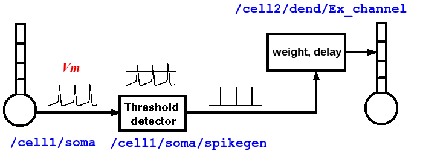
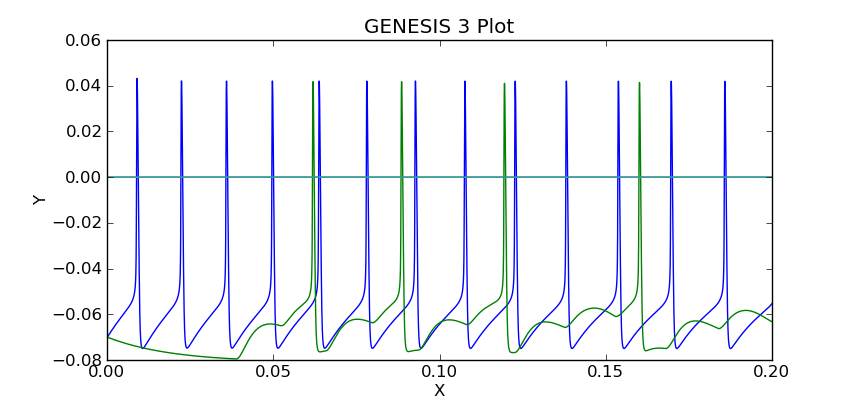
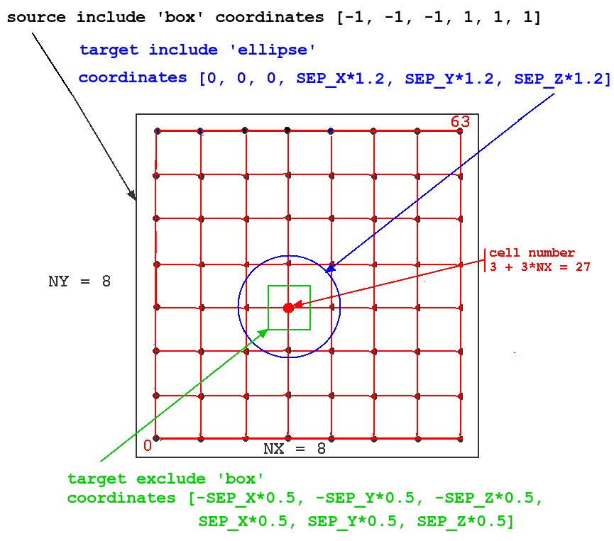
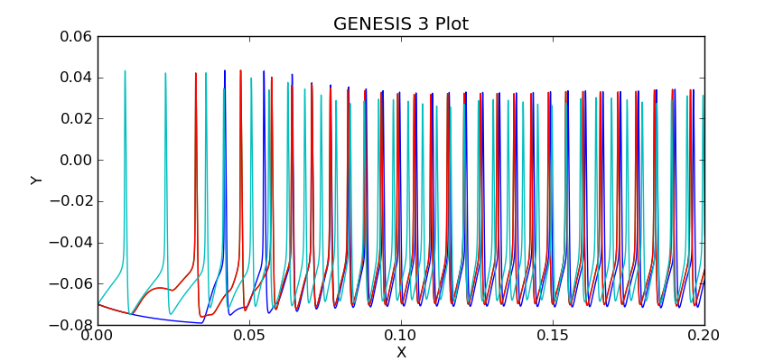

Modeling Synaptic Connections and Large Networks with G-3
=========================================================

**Related Documentation:**

.. start: userdocs-tag-replace-items related-tutorial
.. end: userdocs-tag-replace-items related-tutorial

`Index of GENESIS 3 User Tutorials
<../tutorial-genesis/tutorial-genesis.html>`_

`Creating GENESIS 3 Simulations with Python
<../tutorial-python-scripting/tutorial-python-scripting.html>`_

`Creating a G-3 GUI with Python
<../tutorial-python-gui/tutorial-python-gui.html>`_

Introduction
------------

The tutorial `Creating GENESIS 3 Simulations with Python
<../tutorial-python-scripting/tutorial-python-scripting.html>`_ describes
the basics of creating simulation scripts in Python for single cell models.
The tutorial begins with a demonstration script example that loads a simple
two-compartment cell model 'simplecell' from a saved NDF file.  It then
continues to demonstrate ways to provide simulated experimental inputs to
the cell, such as steady or pulsed injection currents, or random
background synaptic excitation.  Output of the simulation results
is provided with the 'double_2_ascii' output object, which writes
them to a file, similar to the GENESIS 2 'asc_file' command.
This first part of the tutorial is necessary background for
the present tutorial, which illustrates how to build simple
circuits and large networks from a prototype cell.  In particular,
**be sure to read the sections in the Introduction on
'Some background on the G-shell and the NDF file format'
and 'Where are the example scripts and the graphical tools?'**

Later, the python scripting tutorial continues to introduce other types of
output objects such as 'live_output', to send the output to an accessible
Python data structure (a list of lists) for plotting when the simulation is
run, rather than to a file for later plotting.  The tutorial concludes by
converting the basic script into one that puts the non-gaphical parts of
the simulation into a 'G-3 simulation object'.  This provides the basis
for the following tutorial `Creating a G-3 GUI with Python
<../tutorial-python-gui/tutorial-python-gui.html>`_.  This tutorial
adds a Control Panel and a graph, using a set of G-3 Python widgets
that mimic the appearance and functionality of those used in GENESIS 2 with
XODUS.

The present tutorial is based on non-graphical demonstration scripts that
write results to a file, using external G-3 visualization tools for
display.  However, the information described in the previous paragraph
for adding graphics to single cell models will be equally applicable
for network models, and should later be consulted for further development
of your network simulation scripts.

This preliminary version of the network modeling tutorial does not describe
all of the options of some of the commands, some of which are untested or
under development. For some very useful information from earlier GENESIS 2
tutorials, which will be later merged into the final version, it will be
useful to take a brief look at `Making synaptic connections
<http://genesis-sim.org/GENESIS/UGTD/Tutorials/genprog/synchan-tut.html>`_
and `Creating large networks with GENESIS
<http://genesis-sim.org/GENESIS/UGTD/Tutorials/genprog/net-tut.html>`_

The developer test scripts for the G-shell and SSPy components of G-3
provide a resource for obtaining the latest example scripts for network
models implemented with G-shell or Python commands.  These scripts often have
tests for recently implemented features that have not yet been incorporated
into the tutorials.   Typically, new features are first implemented
in the G-shell scripts, and then the Python bindings for the G-shell
commands are tested with the Python scripts.  After upgrading a G-3
installation (with 'neurospaces_upgrade', as described in the installation
documents), examine some of the files in
*~/neurospaces_project/gshell/source/snapshots/0/tests/scripts* and
*~/neurospaces_project/sspy/source/snapshots/0/tests/python*.

Background
----------

The GENESIS 2 tutorial  `Making synaptic connections
<http://genesis-sim.org/GENESIS/UGTD/Tutorials/genprog/synchan-tut.html>`_
uses the 'simplecell' model to illustrate the way that
synaptic connections are created by connecting the soma compartment
to a 'spikegen' object that delivers 'SPIKE' events to a synchan of
another cell.  In G-3, the process is very similar, but the soma,
spikegen, and synchan are connected with 'messages' in GENESIS 2,
whereas the connections in G-3 are somewhat different, as described
in more detail in the following examples.

The following GENESIS 2 tutorial `Creating large networks with GENESIS
<http://genesis-sim.org/GENESIS/UGTD/Tutorials/genprog/net-tut.html>`_
introduces the use of the powerful GENESIS commands **createmap** and
**planarconnect** (or **volumeconnect**) to efficiently create large
netorks of cells connected according to their locations on a rectangular
grid.  The cell used in the example simulation is a simple one-compartment
cell model 'RScell' that has a firing pattern closer to that of typical
cortical pyramidal cells, rather than the fast spiking 'simplecell' model
that was used in the previous tutorials.  Note that both of these cell
models are available in the G-3 cells library, along with others that are
described in `Some NDF files of converted GENESIS 2 models
<../models-library-additions/models-library-additions.html>`_.

This G-3 tutorial follows the organization of the two GENESIS 2 tutorials,
beginning with a simple example of a cell-to-cell synaptic connection
in the G-shell script `two-cells.g3 <figures/two-cells-g3.txt>`_.
However, instead of using the 'simplecell' model that was used in
the previous G-3 and GENESIS 2 scripts, it uses the 'RScell' model
from the outset.

**The 'RScell' model**

The 'RScell' is a very simple one-compartment model of a neocortical regular
spiking pyramidal cell that, in addition to a fast sodium current and
delayed rectifier potassium current, uses a Muscarinic potassium current
(KM) in order to achieve spike frequency adaption. This model is based on
a paper and NEURON simulation by Destexhe et al. (2001).  These
channels produce more realistic firing patterns than those used in
the 'simplecell' model, which is more typical of a fast-spiking inhibitory
interneuron.  The simplicity of this cell model and the limited connectivity
allows our example 'RSnet' network of 1024 neurons to run fairly quickly.

But, it is important to note that single-compartment models with only these
three ionic conductances have limitations.  Although the KM current may
play a role in spike frequency adaption of cortical pyramidal cells, the
behavior of these cells is largely determined by calcium currents and at
least two varieties of calcium-activated potassium currents.  You may
explore the 'RScell' and explore its response to different types of inputs,
as well as some more realistic cortical pyramidal cell models by modifiying
some of the the previous G-3 single cell example scripts to use some of the
other cells in the G-3 cells library. (See `Some NDF files of converted
GENESIS 2 models
<../models-library-additions/models-library-additions.html>`_.)

**Preliminary exercise:**

Convert the `simplecell_pulse.py
<../tutorial-python-scripting/figures/simplecell_pulse.txt>`_ script from
`Creating GENESIS 3 Simulations with Python
<../tutorial-python-scripting/tutorial-python-scripting.html>`_ to use the
RScell, with the 0.05 sec current injection pulse of 1.5e-9 Ampere that is
used in the RSnet model.  Plot the results with the 'g3plot' tool.
Alternatively, adapt the GUI used in `Creating a G-3 GUI with Python
<../tutorial-python-gui/tutorial-python-gui.html>`_ to run the simulation
from a Control Panel and view the plot of membrane potential.

The large network model used in the G-3 version of RSnet uses the G-3
implementation of *createmap* and the command *createprojection*, which is
similar to the GENESIS 2 *planarconnect* command that was used in the
original tutorial.

**The 'RSnet' model**

RSnet is a demonstration of a simple network, consisting of a square grid
of simplified 'RScell' neocortical regular spiking pyramidal cells, each
one coupled with excitory synaptic connections to its four nearest
neighbors.  A brief current injection pulse to the soma of a specified cell
(typically in the center or lower left corner) starts a propagating wave of
excitation.  This simple connection pattern might model the connections due
to local association fibers in a cortical network.

Like the original RSnet tutorial script, the Python example simulation
`RSnet.py <figures/RSnet.txt>`_ given here was designed to be easily
modified to allow you to use other cell models, implement other patterns of
connectivity, or to augment it with a population of inhibitory interneurons
and the several other types of connections in a cortical network.

The GENESIS 2 version has since been further extended to more biologically
interesting networks with both excitatory and inhibitory connections, such
as the Vogels and Abbott (2005) model GENESIS implementation with
Hodgkin-Huxley dynamics. This was used as a benchmark for neural simulators
in the review by Brette et al. (2007).  This `GENESIS implementation of a
network benchmark
<http://genesis-sim.org/GENESIS/UGTD/Tutorials/networks/Vogels-Abbott_net/index.html>`_
would be a good project to implement in G-3, as an extension of RSnet.

Although the RSnet model is too simple to be of serious scientific interest
without the extensions described above, it illustrates the same GENESIS
objects and commands that are used in much more detailed cortical models.
With no competing inhibition, the general behavior of the model can easily
be understood, and the correct behavior recognized from an analysis of the
output. or a visualization of the network acivity using the *netview.py*
tool that is provided with G-3.

Making Synaptic Connections
---------------------------

Usually, we can treat an axon as a simple delay line for the delivery of
spike events that last a single time step. Only if we are interested in
understanding the details of axonal propagation would it be necessary to
model the axon as a series of linked compartments.

As shown in the diagram above, the properties of an axon are split between
two types of GENESIS objects.  Spiking class objects (e.g., a spikegen)
create the spike events, when the membrane potential Vm crosses a
threshold during an action potential. These send SPIKE events to
a synchannel type element (synchan, and in the future, variations with
learning), which contains fields for the propagation delays and synaptic
weighting for each synaptic connection.  As will seen in the examples
below, this information is stored somewhat differently in G-3 than in
GENESIS 2.

Typically, a spike is generated by the spikegen when the soma Vm
exceeds the 'THRESHOLD' value of 0.  In the RSnet examples below,
the field 'REFRACTORY' has been set to 0.004 (4 msec) in order to prevent
multiple spikes from being generated during the time that Vm is above
threshold. Normally, REFRACTORY will be set to something greater than the
maximum width of the action potential at threshold, and less than the
minimum expected interspike interval. Note that the true absolute
refractory period of a neuron is determined by the dynamics of the
conductances that produce the action potentials. The REFRACTORY field of a
spikegen can sometimes be useful for limiting the maximum rate of spike generation.
However, it would only be used to set an absolute refractory period for firing
when using highly simplified neuron models, or create artificial inputs that need
to generate spikes with a specified minimum period.

two-cells.g3
------------

The G-shell script, `two-cells.g3 <figures/two-cells-g3.txt>`_ uses the RScell
model with cell 1 having a steady injection current, and with soma action potentials
generating spikegen events that are passed to cell 2 via a synaptic
connection to the *synchan* Ex_channel.  The connection between the cells uses a
very large (30 msec) propagation delay in order to easily see the effect.

This script, and the other ones used in this tutorial may be obtained by
downloading and saving the archive file `network-scripting-examples.tar.gz
<figures/python-scripting-examples.tar.gz>`_, and extracting the files.
If your browser does not permit this, you may save the files from the
individual links given here.  However, they will have a '.txt' extension
in order to allow display as a text file.

The script begins with::

    ndf_load_library rscell cells/RScell-nolib2.ndf

Note that instead of using the 'ndf_load' command, as in single cell
simulation scripts, this uses the command 'ndf_load_library', which loads
an ndf file into a namespace and reconstructs the model it describes within
that namespace.  This allows the model in the namespace to be used as a
prototype for efficiently creating copies.  'ndf_load_library' should be
contrasted with 'ndf_load', which simply reconstructs the model.  For
further information on G-3 namespaces, see the documentation on `Namespaces
in the Model-Container and the Neurospaces Description Format
<../ndf-namespaces/ndf-namespaces.html>`_ and the documentation for `The
NDF File Format <../ndf-file-format/ndf-file-format.html>`_.

In this example, the command creates the namespace '::rscell::' with a
prototype cell having the elements /cell/soma, /cell/soma/Ex_channel, etc.

The excitatory synchan of the cell used to build the network will have the
default parameters given in the NDF file.  Typically the conductance
density and the reversal potential will need to be set to a more
appropriate value.  The following lines set these values::

  model_parameter_add ::rscell::/cell/soma/Ex_channel G_MAX 0.04330736624
  model_parameter_add ::rscell::/cell/soma/Ex_channel Erev 0

Here the actual conductance in Siemens is G_MAX * soma_area, where
soma_area can be calculated from the dimensions of the compartment
(a sphere of diameter 105 micrometers, or cylinder of length and diameter
of 105e-6 m) to be 3.463609149e-08 m^2.

In principle, the absolute value of 1.5e-9 S could be set directly.  In
RScell-nolib2.ndf, G_MAX is stored as a conductance density and scaled to the
surface area by the model-container when it is fetched by a solver.  Note that
the model-container implements the scaling operation.  A parameter instance
would in principle be scaled, but should not be scaled when it is fetched
by the solver.  It should be defined in the NDF file with the 'FIXED' function.

An NDF example of 'fixing' a parameter at a chosen value is (from
channels/nmda.ndf)::

  PARAMETERS
        PARAMETER ( Erev = 0.0 ),
        PARAMETER ( G_MAX = FIXED ( PARAMETER ( value = 6.870657376e-10),
  PARAMETER ( scale = 1 ), ), ),
  END PARAMETERS

However, it is not possible to attach functions (FIXED or other) to
parameters from the gshell or sspy at present.  For now, the conductance
density should be calculated from the compartment dimensions and fixed
value, then set with 'model_parameter_add'.

Next, a network element is created to be the root of the hierarchy
of cells::

  create network /two_cells

The next two commands create the two components '/two_cells/1' and
'/two_cells/2' as references to '::rscell::/cell', with the same
parameters, including the values of the synchan G_MAX and Erev that were
set previously in the namespace prototype::

  insert_alias ::rscell::/cell /two_cells/1
  insert_alias ::rscell::/cell /two_cells/2

Here, '1' and '2' behave as copies of the prototype cell.  Internally they
are stored in a compact graph that reduces the memory footprint of the
model.  For more details on the representation of synaptic connections, see
the section below '**Storage of connection information in G-3**'.

To connect the two cells '1' and '2' together in a simple
network, we need to create a projection element::

  create projection /two_cells/projection

Note that this is not the same as the 'createprojection' command, which is
described later below.  A projection holds a group of connections between
cells.  In this example, there is only one connection:  a synaptic
connection between the spike generator in the soma of cell 1, and the
excitatory synchan in cell 2.  The connection is created with the
statements::

  model_parameter_add /two_cells/projection SOURCE /two_cells
  model_parameter_add /two_cells/projection TARGET /two_cells

This means that source and target of the connection (or possible multiple
connections) will involve cells in the '/two_cells' population.  To make
a connection that originates in cell 1, we need to provide a 'connection
symbol' that can be used to refer to this connection and to hold the
parameters of the connection::

  create connection_symbol /two_cells/projection/1

The '1' is an arbitrary chosen name of the connection, and is not
referencing cell 1.  A second connection could be called '2' or
even 'second_connection' or whatever the user chooses.

Then, connection '1' is given the parameters needed to have a presynaptic
event come from the spike generator in the soma of cell 1, and a
postsynaptic event to occur at a synapse formed with the Ex_channel in cell
2::

  model_parameter_add /two_cells/projection/1 PRE 1/soma/spike
  model_parameter_add /two_cells/projection/1 POST 2/soma/Ex_channel/synapse
  model_parameter_add /two_cells/projection/1 WEIGHT 2.0
  model_parameter_add /two_cells/projection/1 DELAY 0.03

Note that, unlike GENESIS 2, in which the synaptic weight and propagation
delay are stored in the synapse of the target neuron, here they are
stored in the connection symbol for the connection '1'.

Next, add an injection current to the cell 1 soma, and provide outputs
of relevant parameters::

  inputclass_add perfectclamp current_injection_protocol name current_injection command 1e-9
  input_add current_injection_protocol /two_cells/1/soma INJECT
  output_add /two_cells/1/soma Vm
  output_add /two_cells/2/soma Vm
  output_add /two_cells/2/soma/Ex_channel Gsyn
  output_add /two_cells/2/soma/Ex_channel Isyn

These are commands are similar to the ones used in single cell
simulations for input and output.  Note the use of the alias
to allow references to individual cells.  As no output file name
was specified, the output will go to the default file '/tmp/output'.

Finally we need to set up the solvers to be used.  As with single cell
models, Heccer is used to perform the computations for the cells.  However
the Discrete Event Solver (`DES <../des/des.html>`_) is needed for the
synaptic connections in the network.  First, some commands are used to
configure the solvers::

  heccer_set_config disassem_simple
  des_set_config disassem_simple

In thse statements, 'disassem_simple' is the name of a
configuration that is used for development.  In the future, the
default configuration may be used here, and the 'set_config' commands
may be eliminated.

The 'set_verbose' command can be used to control the amount of output
is generated when the model is set up and run::

  set_verbose debug

This line will normally be commented out to prevent a flood of
detail, or set to a lower verbosity level.  The use of this command
is described in the G-shell documentation 'The GENESIS 3 Shell Software
Component <../gshell/gshell.html>`_.

Then, we assign the Heccer solver to the cells, and DES to the projection::

  solverset /two_cells/1 heccer
  solverset /two_cells/2 heccer
  solverset /two_cells/projection des

Finally, the model is run, as usual::

  run /two_cells 0.2

The script can be run with the command::

  $ genesis-g3  two-cells.g3

At this point, you may enter gshell commands to explore the network, for
example::

  genesis > list_elements /two_cells
  ---
  - /two_cells/1
  - /two_cells/2
  - /two_cells/projection
   genesis > list_elements /two_cells/2/soma
   ---
  - /two_cells/2/soma/Na_pyr_dp
  - /two_cells/2/soma/Kdr_pyr_dp
  - /two_cells/2/soma/KM_pyr_dp
  - /two_cells/2/soma/Ex_channel
  - /two_cells/2/soma/spike

The network can be explored in more detail by invoking the `Studio
<../studio/studio.html>`_ from the G-shell using explore command::

  genesis > explore

To explore the structure of the constructed model, choose the 'Explorer'
menu button in the window that pops up.  You can then browse the model in
the left panel of the window that pops up by double clicking.  In the title
of each window that is openend, you see the full path name of the model
element you are inspecting.  Use the 'Quit' menu button to close all the
windows and return control to the command line shell.

For some more information on the use of the Studio to explore connections.
see the `Notes on using the Neurospaces Studio <figures/studio-notes.txt>`_.

When you are finished, give the command::

  genesis > quit

At this point, you will find a file in /tmp/output which you may
examine with the 'g3plot' tool::

  $ g3plot /tmp/output

The plot should look like this:

Note the delay before cell 2 responds to the spikes generated by cell 1.
The magnitudes of the synaptic conductance and current are much smaller than
the membrane potentials, so one would use the "zoom" tool to inspect them,
unless they were plotted separately, or saved to a different file.

The next example illustrates the "memory efficient" method of constructing
large networks.  But first, it is time for some more explanation of
the way that synaptic connections are treated in G-3.

Storage of connection information in G-3
----------------------------------------

There are two ways to store connection information in the G-3 Model
Container:

1. The 'two-cells.g3' script illustrates the use of a 'connection_symbol'
to hold the information for each synaptic connection.  This type of
"flexible connection" can be useful when a model requires very specific
individual cell-to-cell connections that cannot be generated from the
algorithms that are available with the 'createprojection' command.  It also
makes it possible to set the connection parameters for any connection
individually.  However, when storing the individual connections in a large,
highly connected network model, this method uses a great deal of memory,
and is not very efficient.

2. The 'rsnet-2x2-createprojection' script illustrates the second way,
using the 'createprojection' command.  It is assumed that the cells lie on
one or more two-dimensional grids of equally spaced points, created with
the 'createmap' command and connected according to options specified with
the 'createprojection' command.  These "memory-efficient" connections
use a fixed set of parameters, currently pre- and
post-synaptic target serial identifiers and delay and weight of the
connection.  Memory efficient connections don't have a user-chosen
label, as is done with flexible connections.

For more details on the representation of synaptic connections, see
the `Technical Notes on Connections <figures/connection-notes.txt>`_.
The document `Model of a Connection <../ndf-connections/ndf-connections.html>`_
describes how synaptic connection information is stored in the NDF format.

The rsnet-2x2-createprojection script
-------------------------------------

The G-shell was not designed to be a full programming language with loops,
conditionals, nor other features found in languages such as Perl or Python.
When creating simulations that involve many cells, either a 'wildcard'
notation is needed or a mechanism to interate over the cells in the
network.  Therefore the script 'rsnet-2x2-createprojection' is written in
Perl in order to provide an interface to the gshell functions used to
create and simulate the network.

As the Python example to be given later provides a more user-friendly way
to do the same thing, the following description will concentrate only on
the commands that illustrate the 'memory efficient' method of creating a
network, and the notation that will be used any scripting language that
implements these commands.  Normally, only developers will use Perl
for scripting test cases.

The script `rsnet-2x2-createprojection <figures/rsnet-2x2-createprojection.txt>`_
begins with a header identifying it to be executed as a Perl script, with
display of warnings::

  #!/usr/bin/perl -w

and continues with some definitions needed to find the needed paths and
modules.  Then it defines the values of NX, NY, SEP_X, SEP_Y, SEP_Z,
as well as the synaptic weights and delays of the connections.

As in the previous example, the script uses::

  ndf_load_library('rscell', 'cells/RScell-nolib2.ndf');

followed by 'model_parameter_add' commands to change some properties
of the excitatory synchan 'Ex_channel' in the prototype cell.  Then the
network object is creaed with::

  create('network', '/RSNet');

At this point, the namespace '::rscell::/' has been created with the cell
prototype.  However, the work of creating the cells is performed, not by
creating an alias for each cell, but with a more efficient algorithm that
creates a representation of the prototype cell at points on a rectangular
grid.  The are NX points along the x-axis, with a spacing SEP_X, and NY
points along the y-axis, with a spacing SEP_Y.  The cells are numbered from
0 to NX*NY - 1.  In this scaled down test example, NX and NY are set to 2,
but a network of any size can be created by changing these variables.  The
'createmap' command takes these arguments::

  createmap('::rscell::/cell', '/RSNet/population', $NX, $NY, $SEP_X, $SEP_Y);

Then the 'createprojection' command is used, not only to create
the projection used for connections within this population of cells,
but also the connections within the projection.  The `createprojection command
<../command-createprojection/command-createprojection.html>`_ has many
parameters to cover various algorithms for creating connections between
cells.  The ones needed for variations of the RSnet model are given in the
Perl code::

  createprojection (
     {
      root => '/RSNet',
      projection => {
          name => '/RSNet/projection',
                    },
      source => {
          context => '/RSNet/population',
          include => {
                     type => 'box', # type => 'all' removes need for line below
                     coordinates => [ '-1', '-1', '-1', '1', '1', '1', ],
                    },
                },
      target => {
          context => '/RSNet/population',
          include => {
                     type => 'ellipse',
                     coordinates => [ 0, 0, 0, $SEP_X * 1.2, $SEP_Y * 1.2, $SEP_Z * 0.5, ],
                     },
          exclude => {
                     type => 'box',
                     coordinates => [ -$SEP_X * 0.5, -$SEP_Y * 0.5, -$SEP_Z * 0.5, 
                       $SEP_X * 0.5, $SEP_Y * 0.5, $SEP_Z * 0.5, ],
                    },
                },
      synapse => {
          pre => 'spike',
          post => 'Ex_channel',
          weight => {
                     value => $syn_weight,
                    },
          delay => {
                    value => $prop_delay,
                   },
                 },
      probability => '1.0',
      random_seed => '1212.0',
     },
  );

The meaning of the keywords 'include' and 'exclude' in the context of this
model can best be seen in this figure:

The figure illustrates how these options would be applied to a network of
64 cells with NX = NY = 8. The particular source cell for the connections
shown (one of all in the source 'include' region, i.e. all of cells) is
number 3 + 3*NX = 27.

In this simulation, we want to connect each source spike generator to the
excitatory synchans on the four nearest neighbors. To do this, we define
the source 'include' region to be a rectangle (box) with a very large range
(-1 to +1 meters in each direction!), so that every cell in the network
will be treated as a source.

We want the target for the connections, relative to the source, to be an
ellipse (or circle) that is large enough to include the four neighbors. It
is generally a good idea to set the target ellipse axes or box size
somewhat higher than the cell spacing, to be sure that the cells are
included. Although this isn't a problem with our single-compartment cell,
it can be an issue if the target synapses are located in a distal
dendrite compartment that is displaced by some amount from the cell origin.
In this case it is an ellipsoid centered on (0,0,0), and having principal
axes of length equal to 1,2 times the cell separation.

We also want to define a target 'exclude' region that excludes the
source cell, so that it doesn't connect to itself.  This is done by
defining the region to be a box centered on the source, with sides equal to
the half cell separation in each direction.

The probability of a connection is set to 1.0, so all connections will be
made that fit this prescription.  A random number seed is set for
making probabilistic connections, but it is not used in this case.

To connect to nearest neighbors and the 4 diagonal neighbors, we would use
a box for the target include that is slighly larger than the desired
region, e.g.::

  include => {
             type => 'box',
	     coordinates => [ -$SEP_X*1.01, -$SEP_Y*1.01, -$SEP_Z*1.01,
	       $SEP_X * 1.2, $SEP_Y * 1.2, $SEP_Z * 0.5, ],
             },

For all-to-all connections with a 10% probability, set both the source
and target include region to have a range much greater than the size
of the network, and 'probability' to 0.1.

The remainder of the script sets up a current injection to the soma of cell
3, refered to as '/RSNet/population/3', and uses a loop to provide output
from each cell.

Likewise a loop is used to set Heccer as the solver for each cell, and
a single 'solverset' command is used to set DES as the solver for the
projection.

The script ends with the commented-out statement::

  # explore();

If the '#' is removed, the script will invoke the Studio, so that you
may explore the model before quitting the simulation.

The rsnet-2x2-createprojection script may be run with the command::

  $ rsnet-2x2-createprojection

Then, the file in /tmp/output can be plotted with the 'g3plot' tool::

  $ g3plot /tmp/output

The plot should look like this:

Can you see the activity in cell 3 propagate, causing cells 2 and 1 to fire,
which then cause cell 0 to fire?

rsnet-32x32-createprojection.pl
-------------------------------

The final G-shell/Perl example `rsnet-32x32-createprojection.pl
<figures/rsnet-32x32-createprojection.txt>`_ extends this model to the full
32x32 network, with some additions and changes in addition to setting
NX and NY to 32, rather than 2.

* A variable for the simulation time $tmax has been added, so that the
  the simulation may be run with ``run('/RSNet', $tmax);``

* The small 20e-06 time step (20 microsec) is far more resolution than is needed
  for the analysis of the network firing.  An output step of 0.2 msec
  should be enough to represent action potentials, so we use the
  statement ``output_time_step(0.0002);`` to set the output interval.
  This significantly reduces the size of the output file.

* In order to generate an output suitable for the 'netview.py' network
  viewer, each line of the file should consist of just the Vm values
  of the 1024 cells at that output step, without the simulation time.
  This is done with the statement ``output_emit_time(0);``.

Although it was not done in this script, you may specify a different
output file than the default '/tmp/output' with a statement such as::

  output_filename('rsnet-32x32-Vm.txt');

As with rsnet-2x2-createprojection.pl, you may run the script on the command line
by typing the name, and explore the model if the final line that invokes
'explore' is uncommented.

You may determine the number of lines in the output file with the command::

  $ wc /tmp/output 
    2500  2560000 27868545 /tmp/output

A significant difference between G-shell and Python outputs is that the
G-shell version does not produce an output for time and step 0, but begins
with the first step.

For 1024 cells and this small (20 microsec) time step, the simulation can
take over a minute to complete.  In principle, the considerable setup time
for storing the connection information could be avoided for subsequent runs
that use the same connections, but different cell model parameters.  Often,
much of the "tuning" of a network model involves modifying the synchan
model conductance G_MAX or its time constants.  This feature has not yet been
implemented in the G-shell simulation examples.

The behavior of the 2x2 network can be understood by plotting the membrane
potenial of the four cells with 'g3plot'.  In order to visualize the
behavior of a large network, one needs other tools.  The G-3 application
'netview.py" was developed as viewer simililar to the GENESIS 2 'xview'
widget, and will be installed with 'g3plot' and the other tools in the
`G3Plot package <../g3plot/g3plot.html>`_.  A development version of
'netview.py' has been included in the archive `network-scripting-examples.tar.gz
<figures/python-scripting-examples.tar.gz>`_ with the example scripts.

To use the viewer, give the command::

  $ netview.py /tmp/output

and look at the Help/Usage menu for detailed instructions.  This explains
the optional header line that a data file may have with necessary
network parameter information.

click "New Data".  As this file has no header, a dialog box appears asking
for the following parameters (and providing default values)::

  Number of entries (number of lines in file): 1250
  Start time: 0.0002
    (normally it will be 0.0, but the first time is step 1).
  Output time step: 0.0002
  Number of cells on x-axis (NX): 32 
  Number of cells on y-axis (NY): 32

Note, that in order to enter the values, it is necessary to hit
"Enter" in a text field for the value to register.  This "feature"
(present in GENESIS 2 XODUS also) could be changed with more
sophisticated validation procedures for entries in the "XDialog" widget.
(A nice project for someone with wxPython programming skills.)

After changing any of the default values that need to be changed,
clik "OK".  The display area will turn black, and a status message
will appear at the bottom "Data has been loaded - click PLay"

Click "Play" and watch the activation spread out from the center.
You may now use the sliders to replay during a particular time period,
or Single Step to advance a frame.  The Forward/Back toggle can move
backwards and the Normal/Fast toggle can be used to play every 10th
frame.

This G-shell implementation of RSnet will be the basis of Python examples
to follow.  However, it gives a steady injection to the center cell, rather
than a single 0.05 sec pulse.  This will be possible with future G-shell
bindings to the pulsegen object, as was done in Python.  However, this may
be done more conveniently in a Python script such as the single cell
example `simplecell_pulse_sim.py
<../tutorial-python-scripting/figures/simplecell_pulse_sim.txt>`_.
This will be the basis of the final example script 'RSnet.py'.

Implementing RSnet in Python
----------------------------

The example script `RSnet.py <figures/RSnet.txt>`_ is still under
construction while the Python bindings are being implemented for the
commands used in `rsnet-32x32-createprojection.pl
<figures/rsnet-32x32-createprojection.txt>`_.

In the interim, check often for new Python network test scripts in your
directory::

  ~/neurospaces_project/sspy/source/snapshots/0/tests/python

after performing 'neurospaces_upgrade' (or to just upgrade the SSPy module,
'neurospaces_upgrade --regex sspy').

Suggested Exercises
-------------------

Of course, the first exercise should be to implement the unfinished
'RSnet.py' model as described above, using the logic of the G-shell/Perl
version, the syntax of working Python test scripts, and the framework
of `simplecell_pulse_sim.py
<../tutorial-python-scripting/figures/simplecell_pulse_sim.txt>`_.

There many variations of the RSnet model that you can try in either the
Python or G-shell/Perl examples.  You can experiment with the effect of
different propagation delays, weights or patterns of connections.  For
longer range connections that the nearest neighbor connnectivity used here,
explore some of the `createprojection
<../command-createprojection/command-createprojection.html>`_
options for random connectivity, or delays based on separation
and conduction velocity.  (These have not been well tested at
the time this tutorial was written.)

However, as suggested earlier, the first step in creating a realistic
cortical model is to add a population of inhibitory neurons, as was done
in the well-documented `GENESIS 2 implementation
<http://genesis-sim.org/GENESIS/UGTD/Tutorials/networks/Vogels-Abbott_net/index.html>`_
of the Vogels and Abbott (2005) model.

A typical simple cortical model contains a population of regular spiking
pyramidal or stellate cells (e.g. the 'RScell' or a more realistic cell
from the models library).  These make excitatory
connections not only with each other, but with a smaller population of
inhibitory fast spiking basket cells (e.g. a 'simplecell').  These can
make inhibitory connections with each other, or with the pyramidal cells.
Thus, there will be two populations and four different projections in this
model to represent the different source and target combinations.

There are typically about 25% as many inhibitory cells as excitatory cells
in such a network. Try adding the inhibitory cell population as a 16 x 16
grid of cells that have twice the separation as the RScells.  If the
'origin' option for 'createmap' has been implemented at this time, the
origin of the cells on this grid should be displaced so that they fall in
between the excitatory cells.

For a given choice of connectivity (short range or long range),
there are many experiments that you can do to achieve a balance
of excitation and inhibition in such a network.

Have fun!

References
----------

Destexhe, A., Rudolph, M., Fellous, J. M. and Sejnowski, T. J. (2001)
Fluctuating synaptic conductances recreate in-vivo-like activity in
neocortical neurons. Neuroscience 107: 13-24.

Vogels TP, Abbott LF. (2005) Signal propagation and logic gating in
networks of integrate-and-fire neurons. J. Neurosci. 25: 10786-10795.

Brette et al., (2007) 

Brette R, Rudolph M, Carnevale T, Hines M, Beeman D, Bower JM, Diesmann M,
Morrison A, Goodman PH, Harris Jr FC, Zirpe M, Natschlager T, Pecevski D,
Ermentrout B, Djurfeldt M, Lansner A, Rochel O, Vieville T, Muller E,
Davison AP, El Boustani S, and Destexhe A (2007).
Simulation of networks of spiking neurons: a review of tools and
strategies. J. Comput. Neurosci. 23: 349-398.
